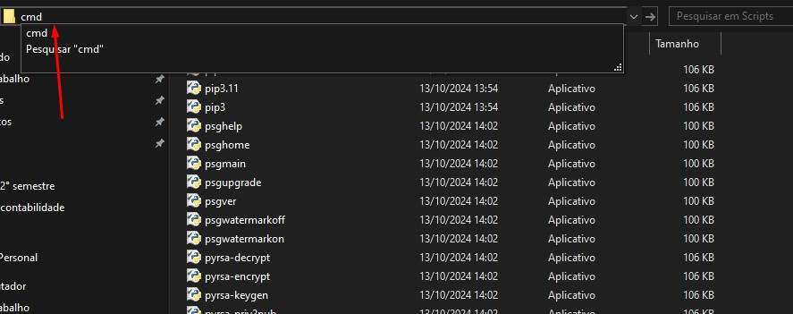
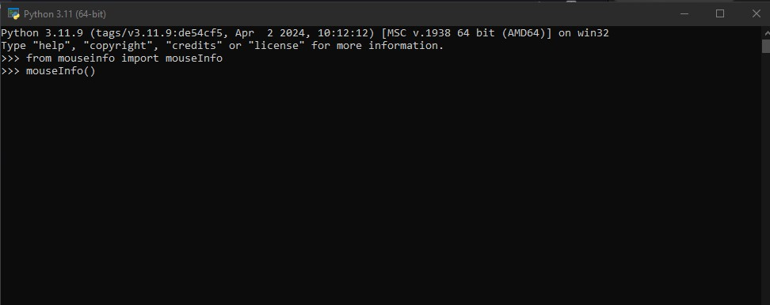

# Projeto-Automação-em-Python

## Projeto totalmente baseado no video https://www.youtube.com/watch?v=UtkPIpov6h8&t=243s para estudos 

### Mouseinfo instalação para caso o pip não esteja funcionando o cmd padrão 

#### passo 1

#### passo 2

#### passo 3

#### passo 4

#### passo 5

#### passo 6

